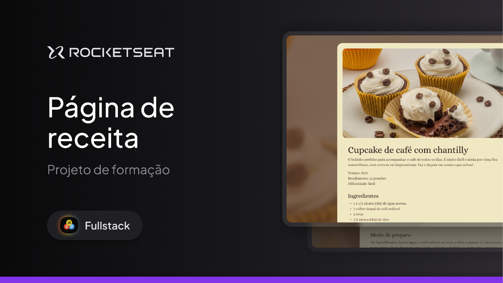

# Projeto Receitas

Esse e o meu primeiro projeto de Html e Css da formação Fullstack da Rocketset. 
O objetivo do projeto e reproduzir um layout no Figma de um site de receita de cookies, utilizando todos os conceitos de HTML e CSS aprendidos até esse momento. 

## Executando
Após clonar o repositório, acesse a pasta do projeto e abra o arquivo `index.html` com o navegador de sua preferência.

[Figma](https://www.figma.com/community/file/1384542229391733447/local-turistico)